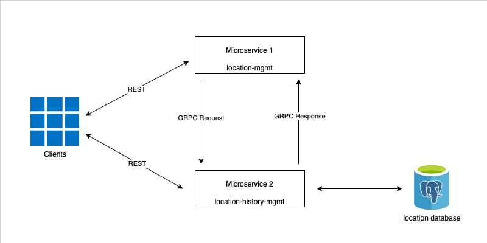
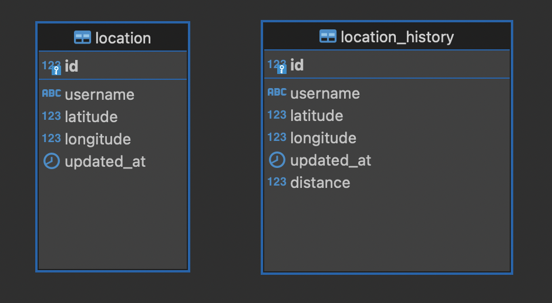

# User Locations App 

## Project overview

### General concept

User Locations App is a system to process user locations developed under echo labstack framework. It’s made up of two microservices with the following features:

Microservice 1 - location-mgmt: Exposes an api to do two tasks:

1. Update current user location by the username.

2. Search for users in some location within the provided radius (with pagination).

Microservice 2 - location-history-mgmt: Exposes an api to do one task:

3. Returns distance traveled by a person within some date/time range. Time range defaults to 1 day.



### Database tables



### Main process flows

Microservice 1 - location-mgmt:

- Save: Update current user location by the username.

1. User updates his current location
2. The current location is updated in the microservice 1 through Save endpoint
3. Microservice 1 sends the updated location to microservice 2 using Protobuf and GRPC
4. Microservice 2 prepares and persists the data

- GetUsersByLocationAndRadius: Search for users in some location within the provided radius.

1. User requires user list in some location within the provided radius
2. The user list is requested in the microservice 1 through GetUsersByLocationAndRadius REST endpoint
3. Microservice 1 sends the reference location and radius to microservice 2 using Protobuf and GRPC
4. Microservice 2 fetches user list and returns it to microservice 1 using Protobuf and GRPC
5. Microservice 1 returns user list through REST response 

Microservice 2 - location-history-mgmt:

- GetDistanceTraveled: Returns distance traveled by a person within some date/time range. Time range defaults to 1 day.

1. User requires traveled distance by a person within some date/time range
2. The traveled distance is requested in the microservice 2 through GetDistanceTraveled REST endpoint
3. Microservice 2 receives the username and date/time range as input and returns the distance traveled during that period through REST response

## Installation

### Prerequisites

Install golang 1.19.2

Install docker

> #### Make sure the installation is correct, strictly follow the steps below in order:

### Microservice 2 - location-history-mgmt

Locate at the directory
```
{$GOPATH}/src
```
Create the following directories
```
{$GOPATH}/src/github.com/oboadagd
```
Locate at the created directory
```
$ cd {$GOPATH}/src/github.com/oboadagd
```
Clone git repo
```
$ git clone https://github.com/oboadagd/location-history-mgmt.git
```
Locate at root directory of location-history-mgmt microservice
```
$ cd location-history-mgmt
```
Create docker containers of postgresql database and microservice location-history-mgmt
```
$ make up
```
Finally, the following result will be obtained:
```
[+] Running 2/2
    ⠿ Container location-history-mgmt-db-1   Started                                                                                                                                                                  0.5s
    ⠿ Container location-history-mgmt-app-1  Started
```
Check it out with docker
```
$ docker ps
CONTAINER ID   IMAGE                       COMMAND                  CREATED         STATUS         PORTS                    NAMES
b2a7758e3d7d   location-history-mgmt_app   "./main"                 8 minutes ago   Up 8 minutes   0.0.0.0:8080->8080/tcp   location-history-mgmt-app-1
cf2ea05fb1ba   postgres:13.8               "docker-entrypoint.s…"   4 hours ago     Up 8 minutes   0.0.0.0:5432->5432/tcp   location-history-mgmt-db-1
```


### Microservice 1 - location-mgmt

Locate at the directory
```
{$GOPATH}/src
```
Create the following directories
```
{$GOPATH}/src/github.com/oboadagd
```
Locate at the created directory
```
$ cd {$GOPATH}/src/github.com/oboadagd
```
Clone git repo
```
$ git clone https://github.com/oboadagd/location-mgmt.git
```
Locate at root directory of location-mgmt microservice
```
$ cd location-mgmt
```
Create docker containers of postgresql database and microservice location-mgmt
```
$ make up
```
Finally, the following result will be obtained:
```
[+] Running 1/1
    ⠿ Container location-mgmt-app-1  Started 
```
Check it out with docker
```
$ docker ps
CONTAINER ID   IMAGE                       COMMAND                  CREATED          STATUS          PORTS                              NAMES
844e56f900a8   location-mgmt_app           "./main"                 31 seconds ago   Up 30 seconds   8080/tcp, 0.0.0.0:8081->8081/tcp   location-mgmt-app-1
b2a7758e3d7d   location-history-mgmt_app   "./main"                 15 minutes ago   Up 15 minutes   0.0.0.0:8080->8080/tcp             location-history-mgmt-app-1
cf2ea05fb1ba   postgres:13.8               "docker-entrypoint.s…"   5 hours ago      Up 15 minutes   0.0.0.0:5432->5432/tcp             location-history-mgmt-db-1
```

### Validate containers parameters

Get details of network among microservices and database. Run below commands
```
$ docker network ls
NETWORK ID     NAME                                     DRIVER    SCOPE
0acd8074b618   bridge                                   bridge    local
d9b5d7fb4925   host                                     host      local
b2ad92d07d3e   location-history-mgmt_location-network   bridge    local
d4509e0c74ae   none                                     null      local


$ docker network inspect location-history-mgmt_location-network

[
    {
        "Name": "location-history-mgmt_location-network",
        "Id": "b2ad92d07d3ecbb38ab079beb9df88f138fbf3bcfbecbbb850dd776fbbb20b17",
        "Created": "2022-10-19T16:28:27.261778424Z",
        "Scope": "local",
        "Driver": "bridge",
        "EnableIPv6": false,
        "IPAM": {
            "Driver": "default",
            "Options": null,
            "Config": [
                {
                    "Subnet": "172.18.0.0/16",
                    "Gateway": "172.18.0.1"
                }
            ]
        },
        "Internal": false,
        "Attachable": false,
        "Ingress": false,
        "ConfigFrom": {
            "Network": ""
        },
        "ConfigOnly": false,
        "Containers": {
            "844e56f900a8cf118719c9bd9f0cca11211421383026cb07ebcb5c81913f1583": {
                "Name": "location-mgmt-app-1",
                "EndpointID": "3eac43635e48ce1d19987d8d09fb560a27fb490e0b9f66b02fec8fbe696cdebd",
                "MacAddress": "02:42:ac:12:00:04",
                "IPv4Address": "172.18.0.4/16",
                "IPv6Address": ""
            },
            "b2a7758e3d7d42d6a344c7c97a7c4d32e248c3010326294e56ff3eeea349c333": {
                "Name": "location-history-mgmt-app-1",
                "EndpointID": "ef35b3deb920d00c33ec2b1b7437aa7c20dd95989ea471c7bfd5bb890a9d6ab9",
                "MacAddress": "02:42:ac:12:00:03",
                "IPv4Address": "172.18.0.3/16",
                "IPv6Address": ""
            },
            "cf2ea05fb1ba66f6aaf7bd37dc038d781964a0e7d44f509becdb90e21b013cb9": {
                "Name": "location-history-mgmt-db-1",
                "EndpointID": "3a596dda3053c5d0a0039d30d9233d5b2a3a867eae6097ffaa59712506c0bb50",
                "MacAddress": "02:42:ac:12:00:02",
                "IPv4Address": "172.18.0.2/16",
                "IPv6Address": ""
            }
        },
        "Options": {},
        "Labels": {
            "com.docker.compose.network": "location-network",
            "com.docker.compose.project": "location-history-mgmt",
            "com.docker.compose.version": "2.6.1"
        }
    }
]

```
At Containers section take ip of each container:
"Name": "location-history-mgmt-db-1"
"IPv4Address": "172.18.0.2/16"

"Name": "location-history-mgmt-app-1"
"IPv4Address": "172.18.0.3/16"

"Name": "location-mgmt-app-1"
"IPv4Address": "172.18.0.4/16"

Validate in file
```
{$GOPATH}/src/github.com/oboadagd/location-history-mgmt/docker-compose.yml
```
Environment variable DB_HOST match ip of container location-history-mgmt-db-1
```
    environment:
      - DB_HOST=172.18.0.2
```
If these don't match, put ip of container location-history-mgmt-db-1 instead of current DB_HOST value.
Must locate at root directory of location-history-mgmt microservice, at that time run the following command
to stop and start again the microservice
```
$ make run
```

Validate in file
```
{$GOPATH}/src/github.com/oboadagd/location-mgmt/docker-compose.yml
```
Environment variable GRPC_HOST match ip of container location-mgmt-db-1
```
    environment:
      - GRPC_HOST=172.18.0.3
```
If these don't match, put ip of container location-mgmt-db-1 instead of current GRPC_HOST value.
Must locate at root directory of location-history-mgmt microservice, at that time run the following command
to stop and start again the microservice
```
$ make run
```

Either microservice has commands to start, stop, and restart:
In case need to start use
```
$ make up
```
In case need to stop use
```
$ make stop
```
In case need to restart use
```
$ make run
```

>> Now the microservices are ready to receive requests from clients. At continuation appear the curls to test the microservices. It's possible to use any IU client to execute then

## Endpoints usage

### Microservice 1 - location-mgmt Endpoints

1. Update current user location by the username.

```
curl --location --request POST 'http://localhost:8081/location-mgmt/locations' \
--header 'Content-Type: application/json' \
--data-raw '{
"userName":"oboada",
"Latitude":35.12314,
"Longitude":27.64532
}'
```

2. Search for users in some location within the provided radius (with pagination).

```
curl --location --request GET 'http://localhost:8081/location-mgmt/locations/users/1/1/10000?page=1&itemsLimit=10' \
--header 'Content-Type: application/json'
```

3. Returns distance traveled by a person within some date/time range. Time range defaults to 1 day.

```
curl --location --request GET 'http://localhost:8080/location-history-mgmt/locations/distance/oboada/2022-09-02T11:26:18+00:00/2022-09-05T15:30:00+00:00' \
--header 'Content-Type: application/json'
```

## Parameter definition

username - 4-16 symbols (a-zA-Z0-9 symbols are acceptable)
coordinates - fractional part of a number should be limited by the 8 signs, latitude and longitude should be validated by the regular rules. For example:
35.12314, 27.64532
39.12355, 27.64538
dates - use ISO 8601 date format (2021-09-02T11:26:18+00:00)

## Testing

### Functional and unitary tests

Locate at root directory in either microservice, run the following command to apply tests
```
$ go test -json ./...
```

### Integration tests

Run integration test about GRPC server in microservice of location-history-mgmt

Locate at root directory of microservice, run the following commands
```
$ go build -v --tags=integration
$ go test -v --tags=integration ./userlocation/server 
```

## Prometheus metrics

### Microservice 1 - location-mgmt
```
curl --location --request GET 'http://localhost:8081/metrics' \
--header 'Content-Type: application/json'
```

### Microservice 2 - location-history-mgmt
```
curl --location --request GET 'http://localhost:8080/metrics' \
--header 'Content-Type: application/json'
```

## Graceful shutdown

System supports graceful shutdown as using echo labstack code for that purpose added in start-up command
```
	// Wait for interrupt signal to gracefully shutdown the server with a timeout of 10 seconds.
	// Use a buffered channel to avoid missing signals as recommended for signal.Notify
	quit := make(chan os.Signal, 1)
	signal.Notify(quit, syscall.SIGSTOP, syscall.SIGTERM, syscall.SIGINT, syscall.SIGQUIT)
	<-quit
	ctx, cancel := context.WithTimeout(context.Background(), 10*time.Second)
	defer cancel()
	if err := echoInstance.Shutdown(ctx); err != nil {
		log.Fatal(err)
	}
```